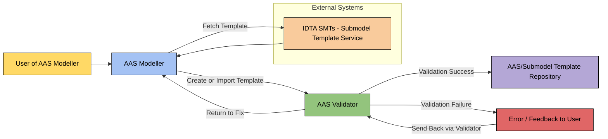

# FirstPublicRepository
First Public Repository

Test to check mermaid

```mermaid
flowchart LR
    U[User of AAS Modeller]:::user --> M[AAS Modeller]:::modeller
    M -->|Create or Import Template| V[AAS Validator]:::validator
    V -->|Validation Success| R[AAS/Submodel Template Repository]:::repository
    V -->|Validation Failure| E[Error / Feedback to User]:::error
    E -->|Send Back via Validator| V
    V -->|Return to Fix| M

    subgraph External Systems
        SMT[IDTA SMTs - Submodel Template Service]:::idta
    end

    M -->|Fetch Template| SMT
    SMT --> M

    classDef user fill:#ffd966,stroke:#000,stroke-width:1px,color:#000;
    classDef modeller fill:#a4c2f4,stroke:#000,stroke-width:1px,color:#000;
    classDef validator fill:#93c47d,stroke:#000,stroke-width:1px,color:#000;
    classDef repository fill:#b4a7d6,stroke:#000,stroke-width:1px,color:#000;
    classDef idta fill:#f9cb9c,stroke:#000,stroke-width:1px,color:#000;
    classDef error fill:#e06666,stroke:#000,stroke-width:1px,color:#000;
```
